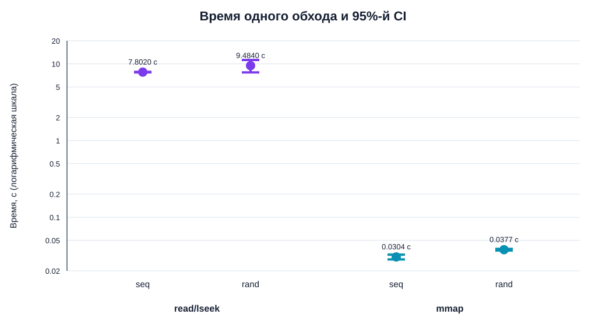

# Сравнение `read`/`lseek` и `mmap`

Обе программы измерялись на графах 1 MiB, seed `427`, в режиме `--write --no-cache`, на CPU 2 и по 10 раз для каждой
топологии. Обычная версия выполняла один обход за запуск, mmap-версия — 100, поэтому ниже время и счётчики нормализованы
на один обход.

## Время выполнения

| Метод          | Топология | Итераций в запуске | Mean запуска, с | Mean одного обхода, с | CI95 одного обхода, с |
|----------------|-----------|-------------------:|----------------:|----------------------:|-----------------------|
| `read`/`lseek` | `seq`     |                  1 |           7,802 |               7,80200 | [7,74170; 7,86230]    |
| `read`/`lseek` | `rand`    |                  1 |           9,484 |               9,48400 | [7,74190; 11,22610]   |
| `mmap`         | `seq`     |                100 |           3,036 |               0,03036 | [0,02818; 0,03254]    |
| `mmap`         | `rand`    |                100 |           3,775 |               0,03775 | [0,03685; 0,03865]    |

По времени одного обхода наблюдаемая mmap-конфигурация быстрее в `257,0` раза для `seq` и в `251,2` раза для `rand`. Это
не следует трактовать как чистый выигрыш только от API: у обычной программы `--no-cache` использует прямой ввод-вывод, а
в mmap-версии это `madvise`, которое не гарантирует обход page cache. Граф размером 1 MiB помещается в RAM, поэтому mmap
получает принципиально более благоприятный путь доступа.

Случайная топология медленнее последовательной в обоих случаях: на `21,56%` для `read`/`lseek` и на `24,34%` для mmap.
Однако для обычной версии CI пересекаются из-за выброса, а для mmap — нет. Подробные распределения: [`read`/
`lseek`](results.md#визуализация), [`mmap`](mmap-results.md#статистика-полного-времени).

## Механизм работы ОС

| Метод и топология      | Voluntary context switches на обход | Minor faults на обход | Mean user / sys на обход, с |
|------------------------|------------------------------------:|----------------------:|----------------------------:|
| `read`/`lseek`, `seq`  |                           132 434,9 |                 142,6 |           0,14600 / 0,81400 |
| `read`/`lseek`, `rand` |                           132 435,1 |                 142,4 |           0,13600 / 0,83400 |
| `mmap`, `seq`          |                               2,015 |                 273,8 |           0,00092 / 0,00050 |
| `mmap`, `rand`         |                               2,037 |                 274,0 |           0,00124 / 0,00054 |

## Общий вывод

`mmap` устраняет системный вызов для каждой вершины и резко сокращает переключения контекста, передавая загрузку данных
механизму page faults. На маленьком графе, помещающемся в RAM, это оказалось значительно быстрее прямого `read`/`lseek`.
При этом случайный порядок остаётся медленнее из-за худшей локальности страниц.

Главными условиями воспроизводимости оказались одинаковая семантика кэша, отсутствие фоновой нагрузки, одинаковый размер
и генерация графов, интерливинг и нормализация по числу обходов. Конкретную разницу в 250–257 раз нельзя переносить на
другие файлы и системы: она характеризует именно исследованные реализации `--no-cache`, HDD и граф размером 1 MiB.

График воспроизводится [скриптом анализа](../scripts/analyze_comparison.py), исходные данные находятся
в [CSV обычной версии](../logs/final/graph-traverse-write-nocache-pilot.csv)
и [CSV mmap](../logs/mmap/final/graph-traverse-mmap-write-nocache.csv).
