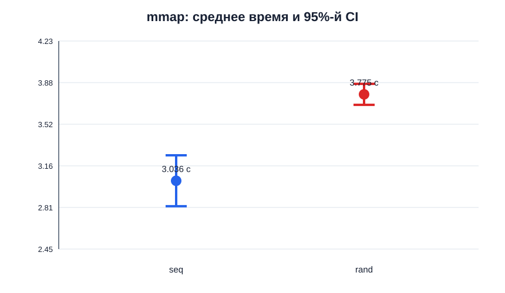
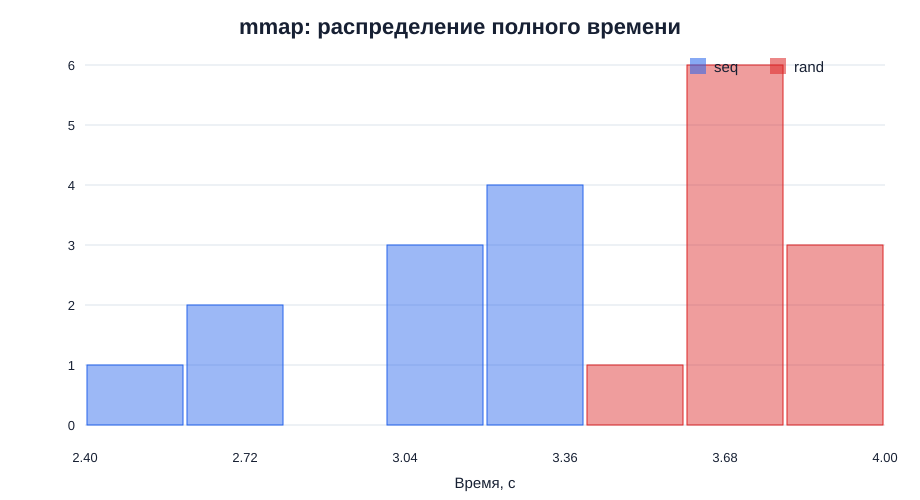

# Результаты `graph_traverse_mmap`

Расчёты выполнены по [10 интерливированным парам](../logs/mmap/final/graph-traverse-mmap-write-nocache.csv). Прогревочные запуски не включены; все 20 измерений завершились с кодом 0, значения не удалялись.

## Статистика полного времени

| Конфигурация | n | Mean, с | s, с | Median, с | IQR, с | CI95, с | Относительная полуширина |
|---|---:|---:|---:|---:|---:|---|---:|
| `seq` | 10 | 3,036 | 0,304 | 3,125 | 0,455 | [2,818; 3,254] | 7,17% |
| `rand` | 10 | 3,775 | 0,125 | 3,760 | 0,185 | [3,685; 3,865] | 2,38% |

`rand` медленнее `seq` в каждом блоке. Разница средних равна `0,739 с`, или `24,34%` относительно `seq`. Парный 95%-й интервал разности `rand - seq` равен `[0,490; 0,988] с` и не включает ноль.

Парные значения дополнительно показаны на [графике блоков](img/mmap-pairs.svg). Расчёты и графики воспроизводятся [скриптом анализа](../scripts/analyze_mmap_results.py).

## Дополнительные метрики

| Конфигурация | Mean user, с | Mean sys, с | Mean voluntary context switches | Mean minor faults |
|---|---:|---:|---:|---:|
| `seq` | 0,092 | 0,050 | 201,5 | 27 383,8 |
| `rand` | 0,124 | 0,054 | 203,7 | 27 403,6 |

В обеих конфигурациях `user + sys` намного меньше `real`: значительная часть времени уходит на ожидание синхронной обратной записи после `msync`. Количество переключений и page faults между топологиями почти одинаково; разница времени объясняется порядком обращений к страницам и локальностью, а не их общим количеством.

## Погрешность и достаточность

Интервалы средних не пересекаются, а парный интервал не содержит ноль, поэтому направление эффекта подтверждено. Целевая полуширина 5% достигнута для `rand`, но не для `seq`. По приближённой формуле `N ≈ (1,96 × s / (0,05 × mean))²` требуется около 16 измерений `seq` и 2 `rand`; при едином дизайне разумно было бы увеличить обе серии до 16 пар. Для вывода о наличии эффекта текущих 10 пар достаточно, для целевой точности оценки `seq` — нет.

## Состояние окружения

Перед серией load average был `0,03 / 0,20 / 0,13`, CPU простаивал на 98,8%, governor — `performance`, температура CPU — 35 °C. После серии CPU простаивал на 100%, governor не изменился, температура составила 33 °C. Существенного загрязнения окружения не видно: [снимок до](../logs/mmap/final/environment-before.txt), [снимок после](../logs/mmap/final/environment-after.txt).

## Вывод

Гипотеза подтверждена: случайный mmap-обход медленнее последовательного примерно на 24%. В отличие от `read`/`lseek`, mmap резко сокращает количество системных вызовов и переключений контекста, но использует page faults для подгрузки страниц. Режим `--no-cache` не отключает page cache полностью; основное замедление записи создаёт синхронный `msync`. Поэтому механизм и стабильность результата отличаются от первого этапа, хотя направление эффекта сохраняется.
