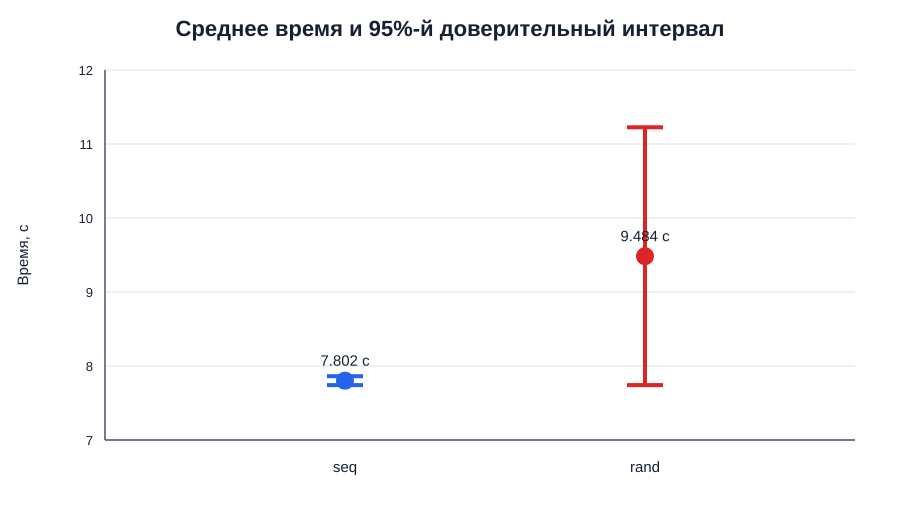
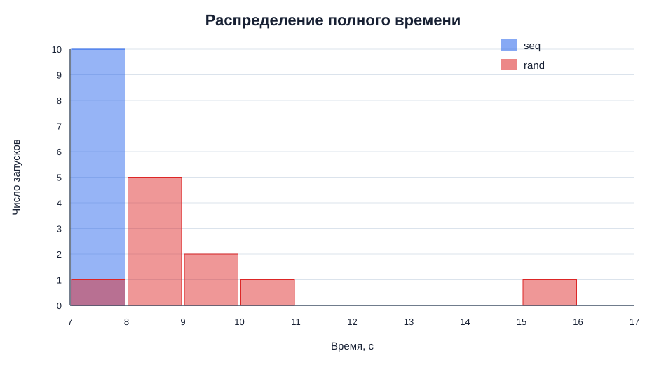

# Результаты эксперимента `graph_traverse`

## Исходные данные

Расчёты выполнены по [выборке](../logs/final/graph-traverse-write-nocache-pilot.csv): по 10 запусков конфигураций `seq`
и `rand`, запуски интерливированы: `seq → rand`, затем `rand → seq`.

## Метод расчёта

Для каждой конфигурации рассчитаны среднее, выборочное стандартное отклонение, медиана, IQR и 95%-й доверительный
интервал среднего. Расчёты и графики воспроизводятся скриптом
[`analyze_results.py`](../scripts/analyze_results.py).

```text
mean = Σxᵢ / n
s = sqrt(Σ(xᵢ - mean)² / (n - 1))
CI95 = mean ± t(0,975; n - 1) × s / sqrt(n)
```

При `n = 10` использовано критическое значение `t(0,975; 9) = 2,262`. Квартили рассчитаны линейной интерполяцией.

## Полное время

| Конфигурация |  n | Mean, с |  s, с | Median, с | IQR, с | CI95, с         | Полуширина CI | Относительная полуширина |
|--------------|---:|--------:|------:|----------:|-------:|-----------------|--------------:|-------------------------:|
| `seq`        | 10 |   7,802 | 0,084 |     7,785 |  0,100 | [7,742; 7,862]  |       0,060 с |                    0,77% |
| `rand`       | 10 |   9,484 | 2,435 |     8,745 |  1,260 | [7,742; 11,226] |       1,742 с |                   18,37% |

Последовательный обход стабилен и удовлетворяет целевой точности 5%. Результаты случайного обхода имеют большой
разброс.

Значение `15,98 с` превышает верхнюю границу `Q3 + 1,5 × IQR = 11,213 с`, но сохранено в выборке согласно заранее
принятому правилу не удалять успешные измерения. Оно заметно увеличивает среднее, стандартное отклонение и ширину
доверительного интервала.

Среднее время `rand` больше `seq` на 21,56%, медиана — на 12,33%. Однако 95%-е интервалы средних пересекаются, поэтому
по выбранному критерию разницу пока нельзя считать статистически подтверждённой.

## Визуализация



Интервал `seq` узкий, а интервал `rand` охватывает большой диапазон и пересекается с интервалом `seq`.



Измерения `seq` сосредоточены около 7,8 с. Распределение `rand` сдвинуто вправо и имеет длинный хвост из-за запуска
`15,98 с`, поэтому среднее заметно выше медианы.

## Требуемое число повторов

Для целевой относительной полуширины 5% применена приближённая формула из [плана](experiment-plan.md):

```text
seq:  E = 0,3901 с; N ≈ (1,96 × 0,0843 / 0,3901)² = 0,179 → 1
rand: E = 0,4742 с; N ≈ (1,96 × 2,4353 / 0,4742)² = 101,319 → 102
```

Десяти повторов достаточно для `seq`, но недостаточно для заданной точности `rand`. Оценка `N = 102` вызвана высокой
дисперсией случайного обхода и чувствительна к редкой задержке `15,98 с`. Если дополнительные измерения недоступны, в
отчёте необходимо оставить фактический широкий доверительный интервал и указать, что целевая точность не достигнута.

## Парное сравнение

Разность для каждого блока определена как `rand - seq`:

| Блок | `seq`, с | `rand`, с | Разность, с |
|-----:|---------:|----------:|------------:|
|    1 |     7,77 |     10,66 |        2,89 |
|    2 |     7,80 |      9,30 |        1,50 |
|    3 |     7,72 |     15,98 |        8,26 |
|    4 |     7,65 |      8,58 |        0,93 |
|    5 |     7,77 |      8,10 |        0,33 |
|    6 |     7,88 |      7,92 |        0,04 |
|    7 |     7,92 |      9,33 |        1,41 |
|    8 |     7,77 |      8,01 |        0,24 |
|    9 |     7,90 |      8,05 |        0,15 |
|   10 |     7,84 |      8,91 |        1,07 |

Средняя парная разность равна `1,682 с`, её 95%-й t-интервал — `[-0,082; 3,446] с`. Во всех десяти блоках `rand`
медленнее `seq`, но интервал парной средней разности включает ноль из-за большого разброса. Результаты качественно
согласуются с гипотезой.

## Дополнительные метрики

| Конфигурация | Mean user, с | Mean sys, с | Mean voluntary context switches | Mean involuntary context switches | Mean minor faults | Major faults |
|--------------|-------------:|------------:|--------------------------------:|----------------------------------:|------------------:|-------------:|
| `seq`        |        0,146 |       0,814 |                       132 434,9 |                               0,9 |             142,6 |            0 |
| `rand`       |        0,136 |       0,834 |                       132 435,1 |                               1,1 |             142,4 |            0 |

Процессорное время и число переключений контекста почти одинаковы. Оценка времени вне `user + sys` составляет 6,842 с
для `seq` и 8,514 с для `rand`, поэтому различие связано главным образом с ожиданием дискового I/O, а не с вычислениями
или page faults.

## Состояние окружения

- Перед серией load average составлял `0,00 / 0,00 / 0,01`, CPU простаивал на 98,8%, governor был установлен в
  `performance`
- После серии CPU простаивал на 100%, governor не изменился. Температуры CPU до и после измерений находились примерно в
  одном диапазоне 27–35 °C
- Снимок «до» сделан в 16:22, измерения начались в 16:23; снимок «после» сделан в 16:26. Существенного изменения
  окружения не зафиксировано

## Итоговый вывод

1. **Сравнение.** Случайный обход во всех 10 блоках медленнее последовательного. Среднее время составляет 9,484 с
   против 7,802 с: разница равна 1,682 с, или 21,56%. Медианы отличаются на 12,33%. Направление эффекта согласуется с
   гипотезой: на HDD случайный доступ требует больше времени ожидания позиционирования и I/O.
2. **Погрешность.** Для `seq` относительная полуширина 95%-го интервала равна 0,77%, что лучше целевых 5%. Для `rand`
   она равна 18,37%. Интервалы средних пересекаются, а парный интервал разности `[-0,082; 3,446] с` включает ноль.
   Поэтому строгий статистический вывод о размере эффекта при выбранном критерии сделать нельзя.
3. **Достаточность.** Текущего `N = 10` достаточно для точной оценки `seq`, но недостаточно для `rand`. Увеличение `N`
   сузит интервал примерно пропорционально `1 / sqrt(N)`. При сохранении текущего разброса для цели 5% требуется
   ориентировочно 102 запуска каждой конфигурации. Если такой объём нецелесообразен, следует оставить фактический
   интервал и явно указать, что заданная точность не достигнута.
